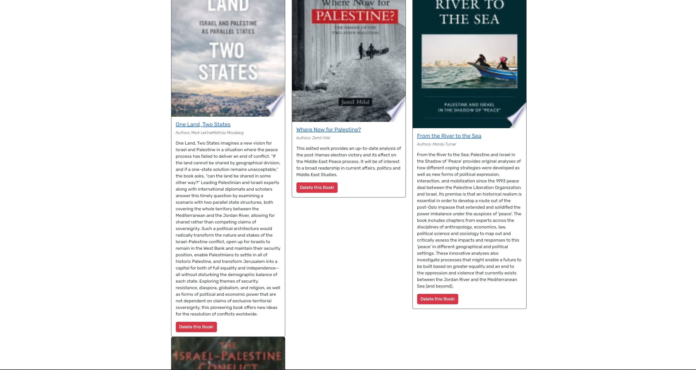

# alghaibb's Google Book Search Engine (MERNG)

This application was provided as a fully functioning Google Books Search Engine built with with RESTful API integrations. The exercise was to refactor the application to make use of the latest technology - namely Apollo/GraphQl. This was the last change required to bring this application to the MERN stack.

**The application's high-level features are:**

- The ability for the user to Login or Sign in (the application will conditionally render components based on the log in state) -

- The ability to search for books using the Google Books API

- The capability to store books to a user's profile for later access
- The option for users to remove books from their list of favourites

## Table of Contents

- [User Story](#user-story)
- [User Acceptance Critieria](#user-acceptance-critieria)
- [Usage](#usage)
- [Installation](#installation)
- [Contributing](#contributing)
- [Screenshots](#screenshots)
- [License](#license)

## User Story

As someone who loves knowledge

I WANT to search for new books to read
SO THAT I can keep a list of books I want to read to gain knowledge

[back to top](#table-of-contents)

## User Acceptance Critieria

This application was developed with the below User acceptance criteria:

```GIVEN a book search engine

WHEN I load the search engine
THEN I am presented with a menu with the options Search for Books and Login/Signup and an input field to search for books and a submit button

WHEN I click on the Search for Books menu option
THEN I am presented with an input field to search for books and a submit button

WHEN I am not logged in and enter a search term in the input field and click the submit button
THEN I am presented with several search results, each featuring a book’s title, author, description, image, and a link to that book on the Google Books site

WHEN I click on the Login/Signup menu option
THEN a modal appears on the screen with a toggle between the option to log in or sign up

WHEN the toggle is set to Signup
THEN I am presented with three inputs for a username, an email address, and a password, and a signup button

WHEN the toggle is set to Login
THEN I am presented with two inputs for an email address and a password and login button

WHEN I enter a valid email address and create a password and click on the signup button
THEN my user account is created and I am logged in to the site

WHEN I enter my account’s email address and password and click on the login button
THEN I the modal closes and I am logged in to the site

WHEN I am logged in to the site
THEN the menu options change to Search for Books, an option to see my saved books, and Logout

WHEN I am logged in and enter a search term in the input field and click the submit button
THEN I am presented with several search results, each featuring a book’s title, author, description, image, and a link to that book on the Google Books site and a button to save a book to my account

WHEN I click on the Save button on a book
THEN that book’s information is saved to my account

WHEN I click on the option to see my saved books
THEN I am presented with all of the books I have saved to my account, each featuring the book’s title, author, description, image, and a link to that book on the Google Books site and a button to remove a book from my account

WHEN I click on the Remove button on a book
THEN that book is deleted from my saved books list

WHEN I click on the Logout button
THEN I am logged out of the site and presented with a menu with the options Search for Books and Login/Signup and an input field to search for books and a submit button
```

[back to top](#table-of-contents)

## Screenshots

### Searching for books  


### Saved books


[back to top](#table-of-contents)

## Usage

Vist the deployed website [here]()

When launched, this application will present with a search field. You can search for books (utilising Google) without logging in, however it is recommended to sign up so that you can save books to your account. You can view and delete saved books when clicking "See Your Books" to navigate to your `/saved` page to see your saved books. You also have an option to delete them.

[back to top](#table-of-contents)

## Installation

The below installations steps are only required if you want to run a local copy or contribute to its design (Skip to [usage](#usage) if you just want to make use of the application)

1. Clone or fork the repo

2. Run the following below to install all the dependencies for both client & server side

```bash
  yarn install
```

3. Once all the dependencies are installed, make sure you're in the root directory of the project and run `yarn dev` to start both the client & server or `yarn start` to run only the server.

[back to top](#table-of-contents)

## License

This application can be used in conjunction with licensing covered in MIT License.

[MIT](https://choosealicense.com/licenses/mit/)

[back to top](#table-of-contents)

## Contact

Email me at: mjaderi97@gmail.com

[back to top](#table-of-contents)